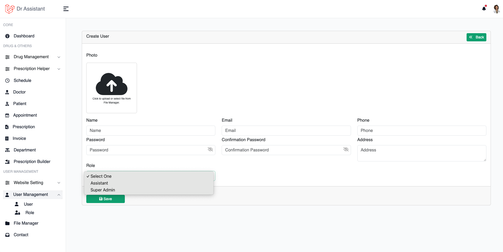
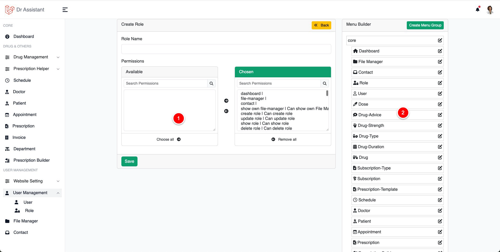

# User &amp; Role Management

## User

Even though there are some predefine role such as Doctor, Super Admin, Patient, Assistant but still you can create
[custom role](#role) with set of permissions.

<table style="none">
<tr>
<td>
To create an user click on User Management from the left sidebar then click on User To Create New user,
</td>
<td></td>
</tr>
</table>

## Role

You can create your own role and give them permissions and design dashboard, so when you assign the role to someone the
user will see the given access and the dashboard what you designed during the role creation process.

<table style="none">
<tr>
<td>
<list style="decimal">
<li>
Chose permissions by selecting them and click on right arrow to so it will move to the chosen box.
</li>
<li>
You will see all the available sidebar items based on your chosen permission, 
you can reorder them, nested them or even change the name of the sidebar item
</li>
</list>
</td>
<td></td>
</tr>
</table>