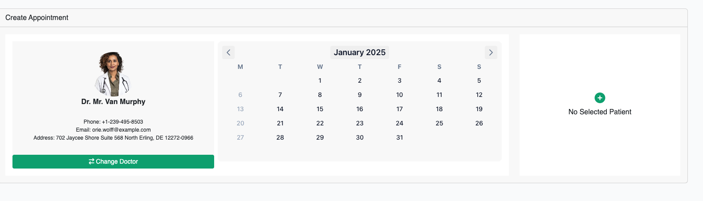
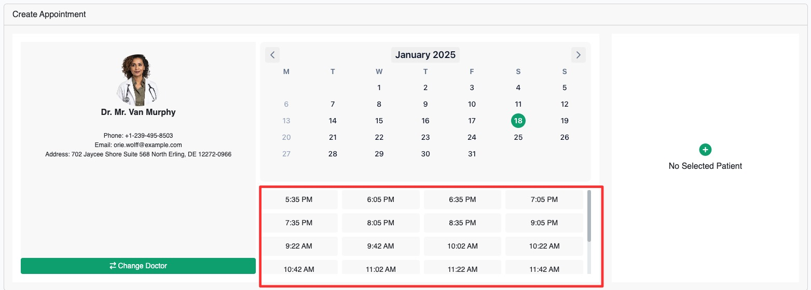
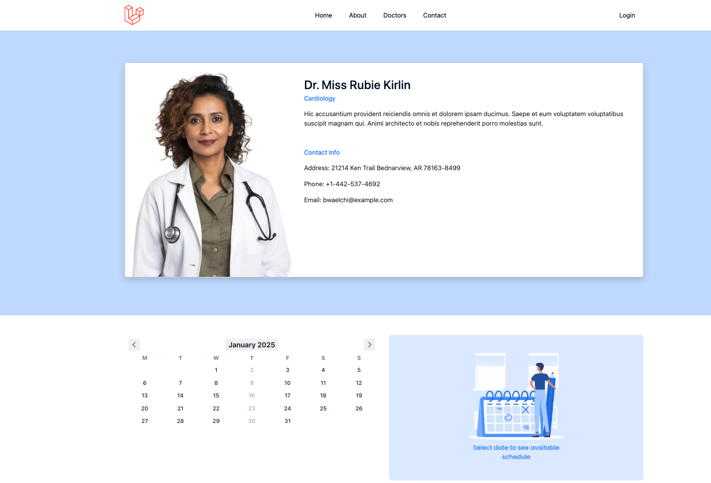
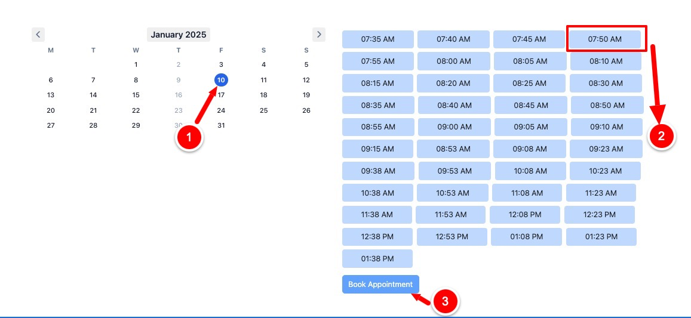
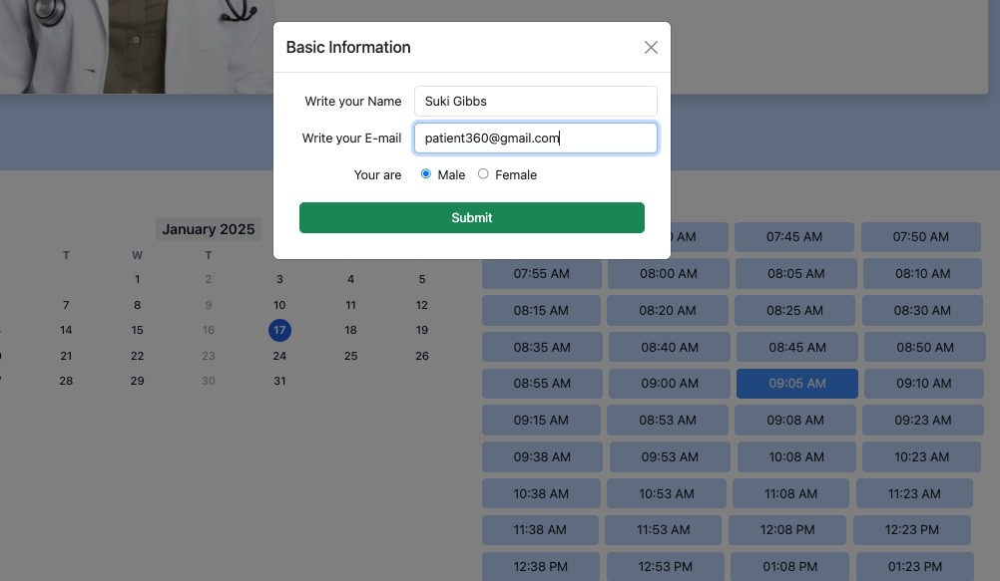
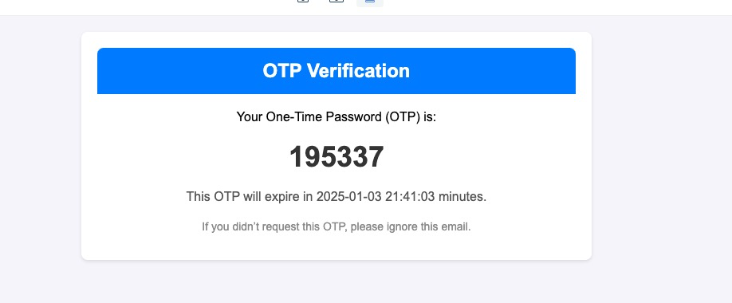
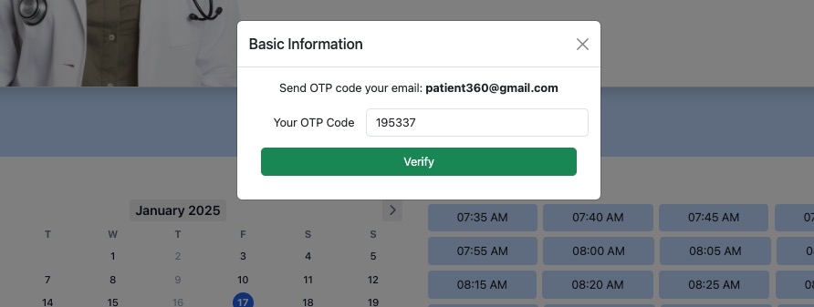

# Appointment

There is two way to create an appointment

1. [Appointment from dashboard (only who has the appointment permission)](#appointment-from-dashboard)
2. [Appointment from website](#appointment-from-website)

## Appointment from dashboard

<table>
<tr>
<td>Click on appointment from left sidebar then click on Create Appointment to start Crating an Appointment

</td>
<td> 

<note>

If you logged in with a doctor account, you will see the Doctor selection part is fill by the logged in doctor and you
cannot change the doctor from doctor account

</note>
</td>
</tr>
<tr>
<td>

Click on the <shortcut>+</shortcut> Button to Select a doctor
Upon selecting a doctor the calendar will be enabled to pick an available appointment date

</td>
<td> </td>
</tr>
<tr>
<td>

By choosing a date from the calendar you will see <a href="schedule.md">available time slot</a> for appointment

</td>
<td>  </td>
</tr>
</table>

To complete appointment you will need to select a patient by clicking <shortcut>No Select patient</shortcut> card.

## Appointment from website

Guest user / patient can take an appointment from website by browsing a doctor page.
It can be a user is browsing the website (i.e `/doctors` page) and wanted an appointment from a selected doctor by
clicking the {style="inline"} button.

This button will take user to the single doctor page and user will this page bellow:

<table>
<tr>
<td>
<ol>
<li>Select a date from the calender</li>
<li>Now select the available time slot</li>
<li>Click book appointment to start booking an appointment</li>
</ol>
</td>
<td></td>
</tr>

<tr>
<td>
Fill the form by your email address and name and submit, you should receive an OTP in your given email which will need in the next step
</td>
<td></td>
</tr>

<tr>
<td>
This is an example otp email
</td>
<td></td>
</tr>

<tr>
<td>
Enter your OTP and click on verify
</td>
<td></td>
</tr>

<tr>
<td colspan="2">Once it's complete you will receive another email that the appointment has been completed</td>
</tr>

</table>