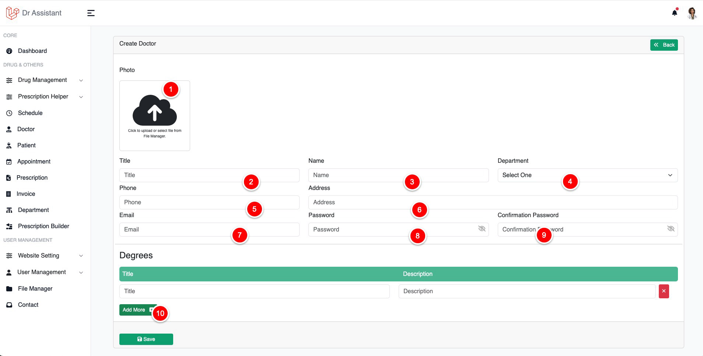

# Doctor Management

## Create Doctor

To create a doctor click on Doctor from the left sidebar, then click
on {style="inline"} button on the top of the table.

<table style="none">
<tr>
<td>
<list style="decimal">
<li>
Click to upload / select doctor profile photo
</li>
<li>
Dr Tile such as Dr. Prof Dr. etc
</li>
<li>Doctor Name</li>
<li>Select The <a href="#create-department">Department</a> </li>
<li>Doctor contact phone number</li>
<li>Doctor contact address</li>
<li>Doctor contact email [will be use to login]</li>
<li>Doctor login password [will be use to login]</li>
<li>Doctor login password confirm</li>
<li>Doctor degrees, click this button to add more</li>
</list>
</td>
<td>

</td>
</tr>
</table>

> Doctor can / will login to the system via given email and password,
> Doctor can change the password anytime after login to the system
>
{style="note"}

## Edit / Delete Doctor

Use edit button at the list page to edit a doctor, delete button to remove a doctor parmanently

## Create Department

To create medical department you will need to click on the Department button from the left sidebar,
Department will be use to filter doctor form doctor list at the webpage.