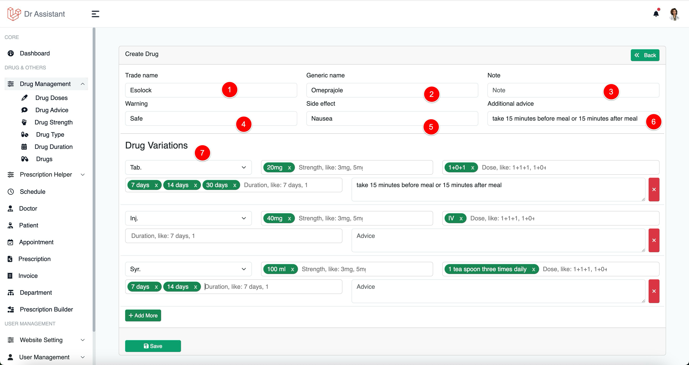
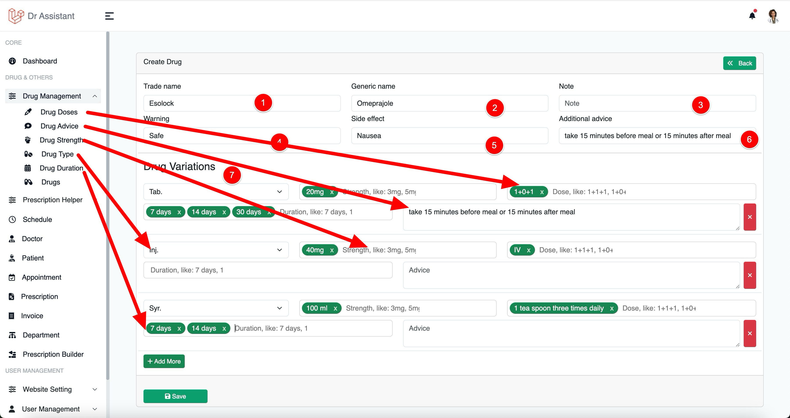
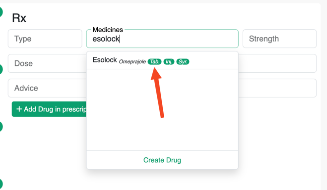

# Drug Management

Proper drug management can you improve your experience at prescription writing.

## Create Drug

To create a Drug you need click on Drug Management from the left sidebar then click on Drugs, then click on Create Drug
button on the top of Drugs table.

You should this screen

{thumbnail="true"}

1. Enter the trade name of the drug
2. Enter generic name of the drug
3. Enter drug note if you have any (not required)
4. Enter drug warning if have any (not required)
5. Enter drug side effect if have any (not required)
6. Enter additional advice if have any (not required)
7. [Drug Variations](#drug-variations): this is the most important part and this will improve your prescription writing
   experience to next
   level, Check [this image](#drug-variation-ref) to know the drug variations reference at where you can manage
   variations data.

### Drug Variations

<table style="none">
<tr>
<td> 

<b>Drug Type:</b> The first dropdown refer the type of drug (i.e: Tablet, Capsule etc) And also note that you can add several variation of a drug.
If you don't see your desire drug type can you create one from drug type menu.

<b>Drug strength</b>, You can add multiple drug strength by separating them via (,) comma or pressing enter when you are done typing.

<b>Drug doses</b>, you can add multiple drug doses by separating them via (,) comma or pressing enter when you are done typing.

<b>Drug duration</b>, you can add multiple drug duration by separating them via (,) comma or pressing enter when you are done typing.

<b>Drug advice</b>, if there are any advice i.e: must apply in dry skin

</td>
<td>

</td>
</tr>
</table>

### Drug variation at Prescription Writing

{thumbnail="true"}

As you can see we can see all the types what we added ruing drug creation, now clicking on tab, inj or Syr it will
automatically fill the rest with boxes with default data what you added during drug creation