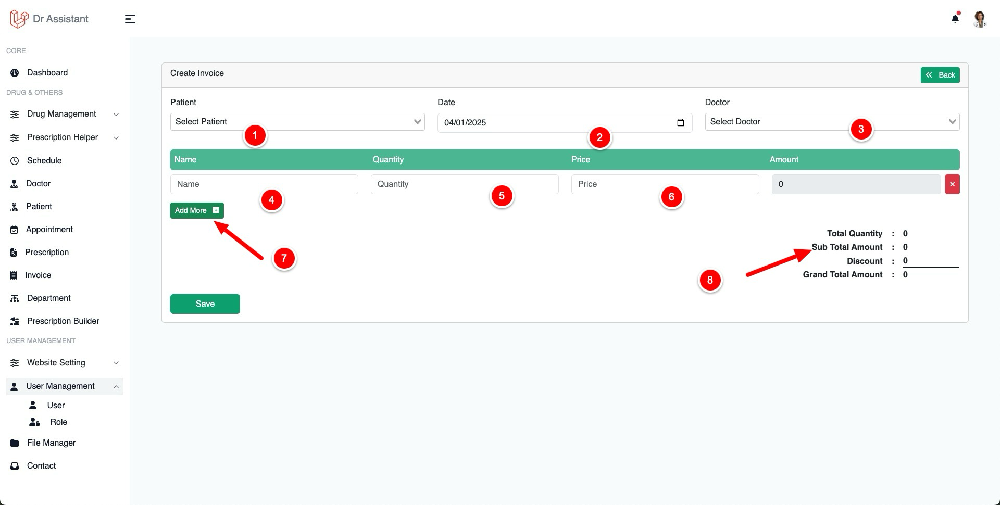
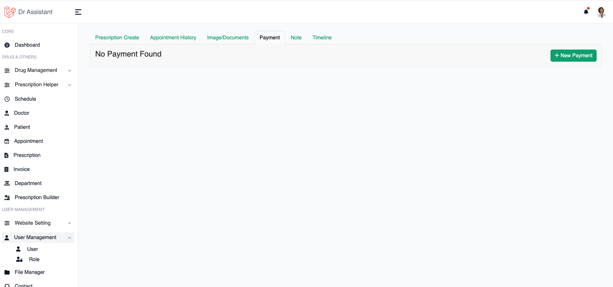
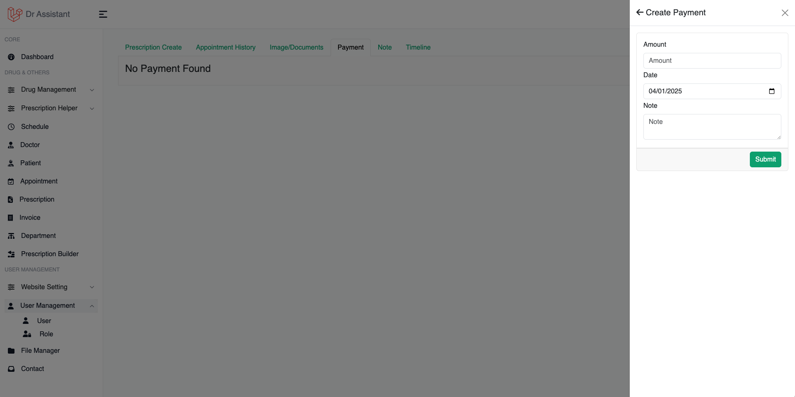

# Invoice

Invoice to keep track your earning and give your patient / customer / insurance company a copy of bill. This will help
you to return you tax.

## Create Invoice

To create an invoice CLick on Invoice from Left Side menu then click on Create Invoice

<table>
<tr>
<td>
<list style="decimal">
<li>
Select patient to whom you want to create invocie
</li>
<li>
Select date of invoice
</li>
<li>
Select doctor
<note>
This option will not appear if you logged with doctor account
</note>
</li>
<li>Give a name of the title of payment</li>
<li>Give number of quantity</li>
<li>This is unit price, by putting the unit price it will calculate the gross at Amount input</li>
<li>If there is more than one item then click this button to add more</li>
<li>You will see the summery here, also you can give discount if you like to</li>
</list>
</td>
<td></td>
</tr>
</table>

## Create Invoice During Appointment

If you already started an appointment and want to generate an invoice for this patient, you don't need to go through all
the step of [Create Invoice](#create-invoice).

<table style="none">
<tr>
<td>
Click on Payment tab and then click on New payment
</td>
<td></td>
</tr>

<tr>
<td>
Give the payment amount in amount input and note if needed,
date will be the current date, but you can change it.
</td>
<td></td>
</tr>
</table>