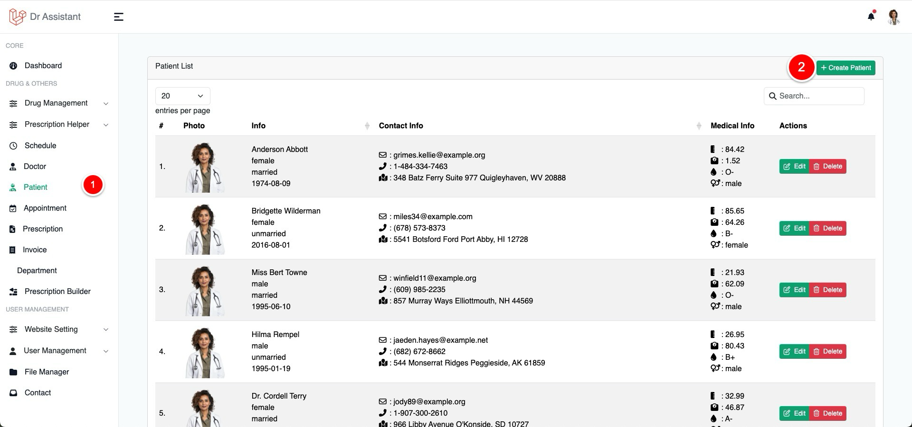
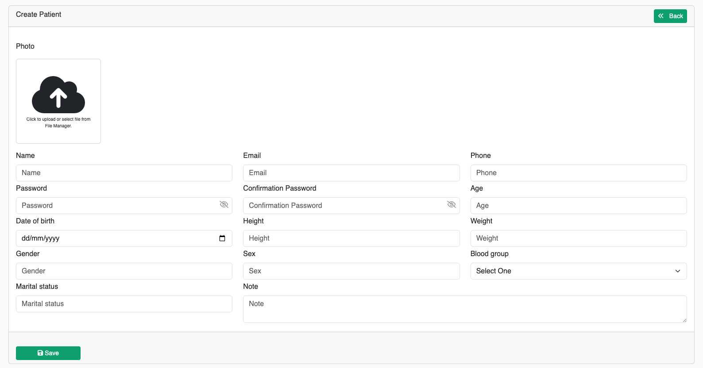
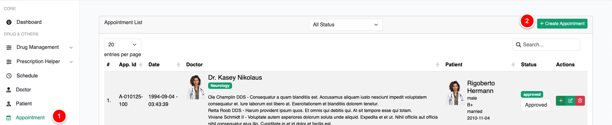
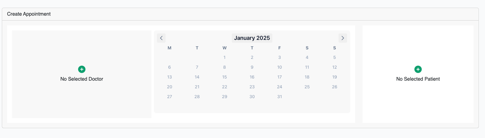
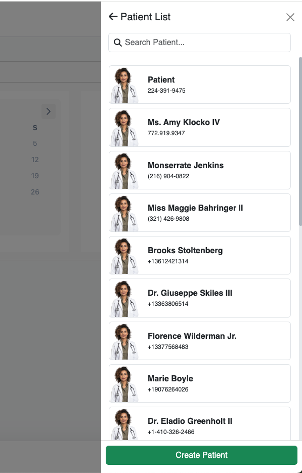
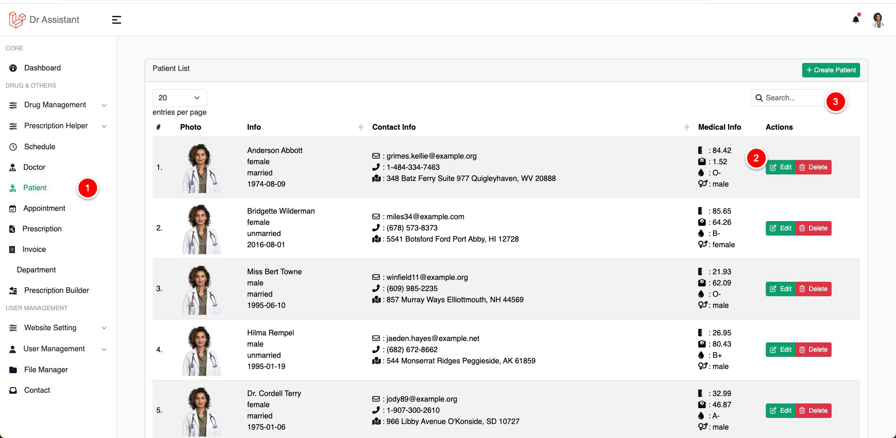
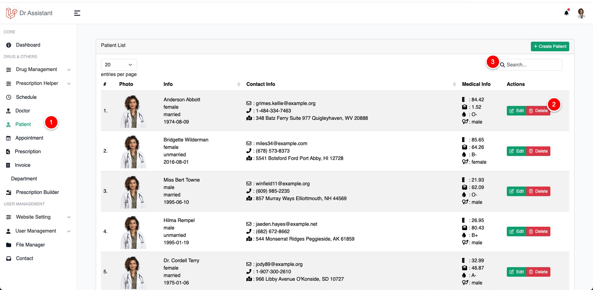
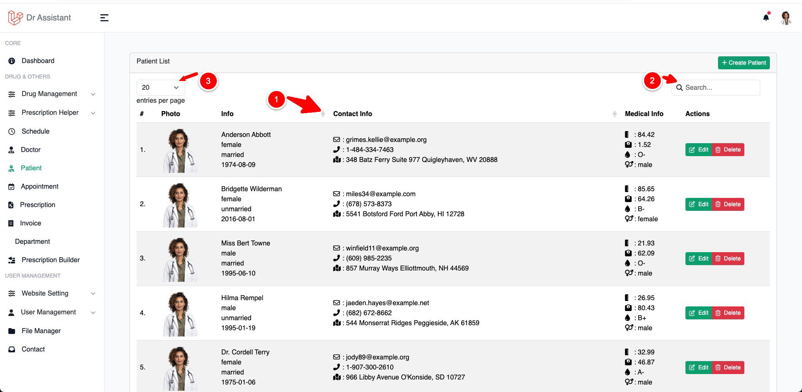

# Patient Management

## Create patient

There are 3 way to create a patient

1. From Patient Management page
2. Appointment page while you try to create an appointment
3. You can create patient from quick appointment as well

<tabs>
    <tab id="windows-install" title="Crate patient from patient management page">
       <table>
         <tr>
             <td>
                 <ol>
                    <li>Visit Patient page</li>
                    <li> Click on create patient button</li>
                 </ol>
           </td>
           <td>
           
           </td>
        </tr>
        <tr>
           <td>
              <ol><li>Fill the form and hit save</li></ol>
           </td>
           <td>              
              
           </td>
        </tr>
       </table>
    </tab>
    <tab id="macos-install" title="Crate patient from appointment page">
        <table>
                 <tr>
        <td>Click on Appointment from the left sidebar and then</td>
        <td></td>
        </tr>
        <tr>
        <td>Click on "No Select Patient"</td>
        <td></td>
        </tr>
        <tr>
        <td>Now click on Create Patient Button if you don't found the patient you are looking for to make an
           appointment</td>
        <td></td>
        </tr>
        </table>
    </tab>
    <tab id="linux-install" title="Crate patient from quick appointment page">
        <table>
        <tr>
        <td>
        <ol>
        <li>Click on Prescription</li>
        <li>Click on "Quick Appointment" on Create Prescription dropdown</li>
        </ol>
        </td>
        <td></td>
        </tr>
        <tr>
        <td>Click on "New Patient" button if you don't found a patient you are looking for</td>
        <td></td>
        </tr>
        </table>
    </tab>
</tabs>

## Update

{width="650"}{thumbnail=true}

1. CLick on the patient
2. Click on the edit bucket to edit a patient
3. Use search to find out the desire patient you want to edit

## Delete

{width="650"}{thumbnail=true}

1. CLick on the patient
2. Click on the delete bucket to delete a patient
3. Use search to find out the desire patient you want to delete

## Sort / Filter / List of patient

{width="650"}{thumbnail=true}

1. To sort a column click on the column header (only those columns has sort icon can be sort)
2. Use this input to search anything from the table of content
3. Use this dropdown to show how many item you want to see at a time in the table