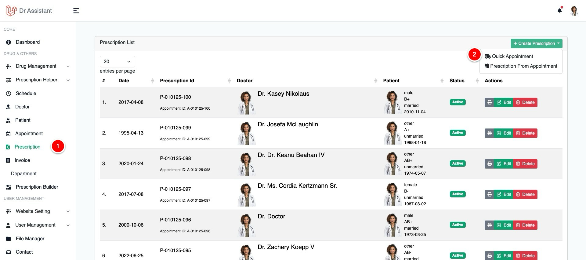
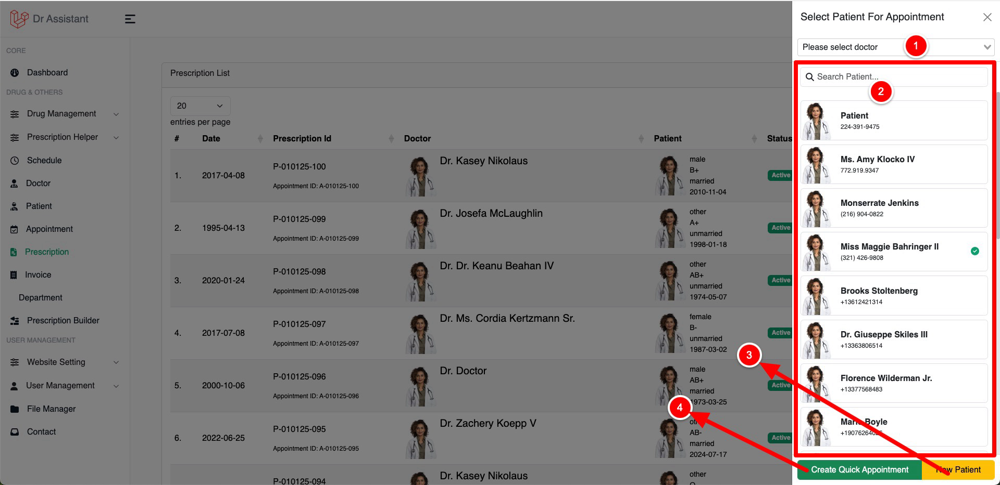
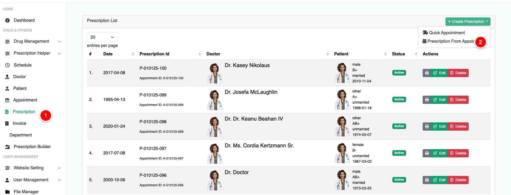
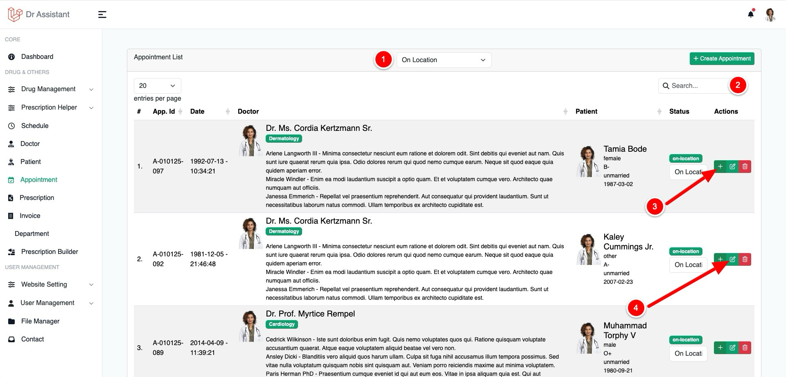
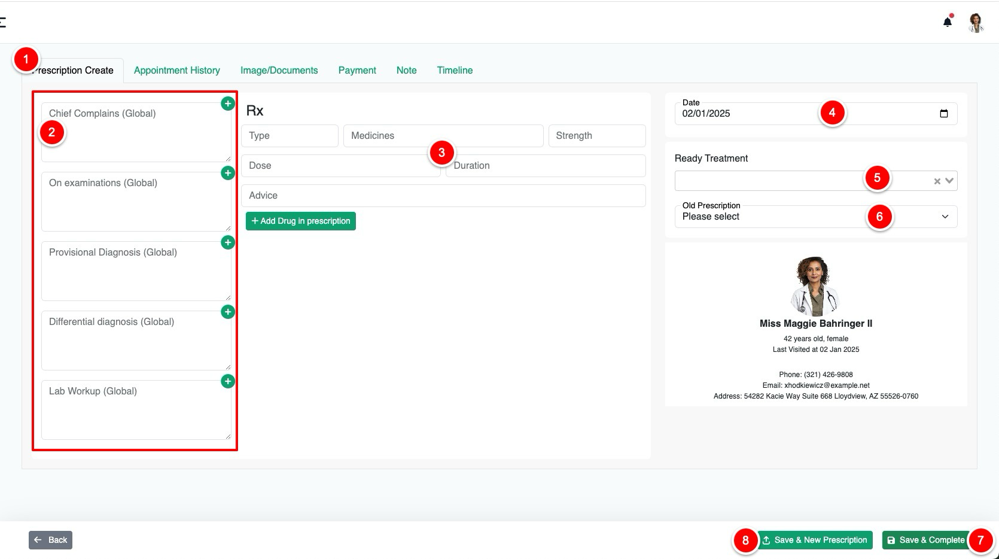
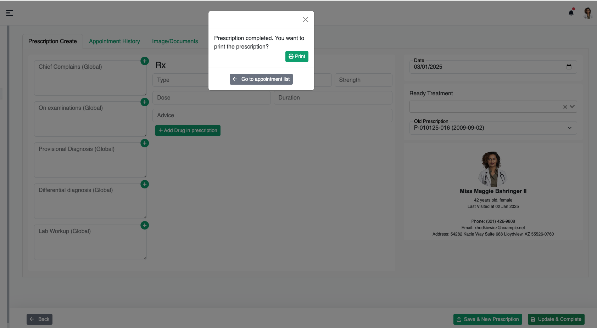
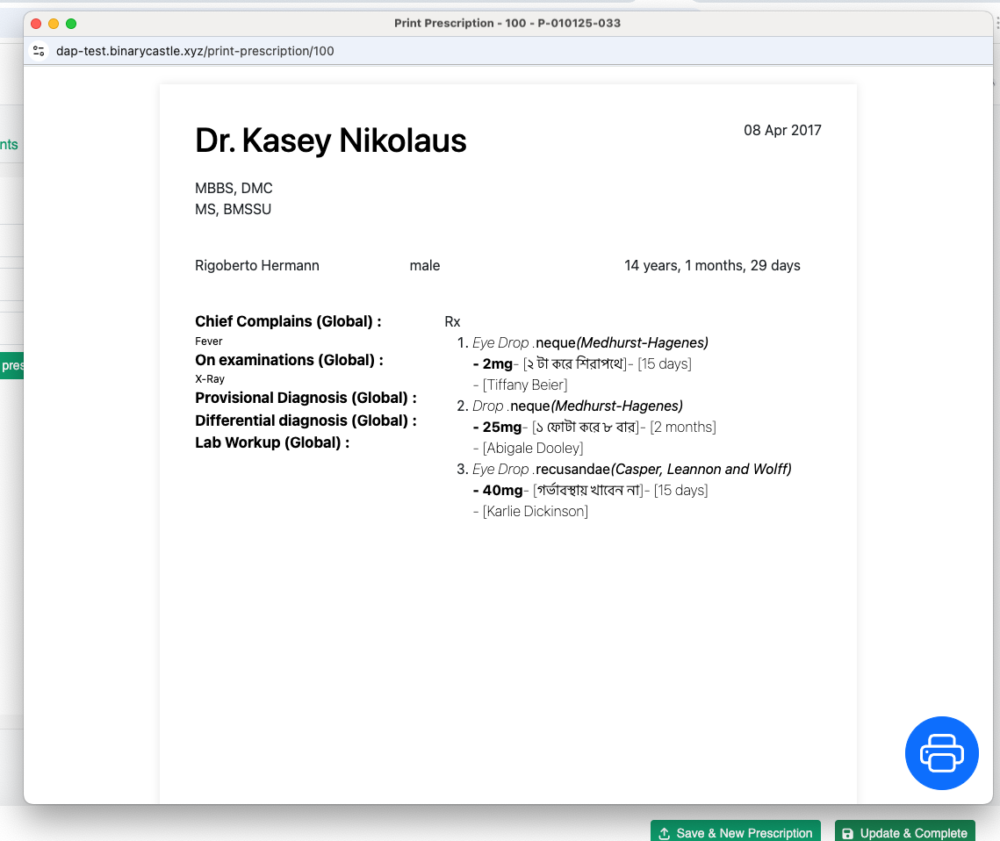

# Prescription

To Create a prescription you will need to have an appointment first but still you can create prescription if there is no
previous appointment. We call it Quick appointment.

## Quick Appointment

<table style="none">
<tr>
<td>
<ol>
<li>Click Prescription from left sidebar then</li>
<li>Click on Create Prescription then click on Quick Appointment</li>
</ol>
</td>
<td>

</td>
</tr>
<tr>
<td> 
<ol>
<li>
Select a doctor from the dropdown 
<warning>

Note that This will only appear if you are not logged in by a Doctor by you have access to create a quick appointment.
<a href="https://hello.com">click here know more about roles and permission</a>

</warning>
</li>
<li>Select patient from the list, you can search by the patient name / email or phone number</li>
<li>If you want to create a new patient click "New Patient"</li>
<li>Click Quick Appointment to create and start an appointment 
<note>

Starting an appointment, you can create prescription, notes, medical documents, invoices and so on

</note>
</li>
</ol>
</td>
<td>  </td>
</tr>
<tr>
<td> <a href="prescription.md#prescription-writing">How to write prescription</a> </td>
</tr>
</table>

## Prescription From Appointment

<table style="none">
<tr>
<td>
<ol>
<li>Click Prescription from left sidebar then</li>
<li>Click on Create Prescription then click on Prescription From Appointment</li>
</ol>
</td>
<td>  </td>
</tr>

<tr>
<td>
<ol>
<li>You can filter the appointment type by status, by default it only show those appointment has status "on-location" </li>
<li>You can search the appointment by the patient / doctor / or appointment id </li>
<li>CLicking this <code>+</code> button will take your to the prescription page, <a href="prescription.md#prescription-writing">Click here to know How to write prescription</a> </li>
<li>Use this button to edit the appointment [note that it has nothing do with prescription] </li>
</ol>
</td>
<td>  </td>
</tr>
</table>

## Prescription Writing

When you are seeing this screenshot bellow, mean you are already in prescription page.

<list type="decimal">
<li>Click this tab if you in some other tab</li>
<li>This section is responsible for Prescription subscription.
<note>

You can modify the prescription subscription by order it / delete or create a 
new one which is not in the list from 
<a href="prescription_helpers.md">Subscription Type</a> user Prescription helper 

</note>
</li>
<li>
This is Drug section, to add drug in the prescription you can you select/create drug, drug type, strength, doses, 
duration adn drug advices 
</li>
<li>
Prescription date, by default it will show the current date of your computer but can you change it to any date you like to
</li>
<li>Ready treatment, this is part of Prescription Helper / Templates, Doctor can create some prescription 
template by putting some drugs and advices what they can use later in any prescription 
by clicking on it from the dropdown</li>
<li>Doctor can also generate prescription from old prescription from this selection, 
just click on the dropdown and click on the prescription you want to get the data from</li>
<li>
Save & Complete will change the status of the prescription and appear a popup where you can print the prescription  
</li>
<li>
Use Save & New prescription if you don't want to complete the appointment but save the prescription and print it.
</li>
</list>
<note>

Doctor can create many prescription under a single appointment, the status of the appointment will be unchanged until you click on 
save & complete or update the status form appointment table

</note>

## Prescription Printing

By Hitting Save & New Prescription or Update & Complete You will this modal bellow

By Clicking on the Print Button it will open the prescription printing page.

CLicking on the big print button will open a print window to print the prescription, after prting the prescription you
can simply close the window.

> You can change the design of the prescription easily using our built-in prescription builder,
> To know more about prescription builder [Click Here](prescription_builder.md) to read our Prescription Styling
>
{style="note"}