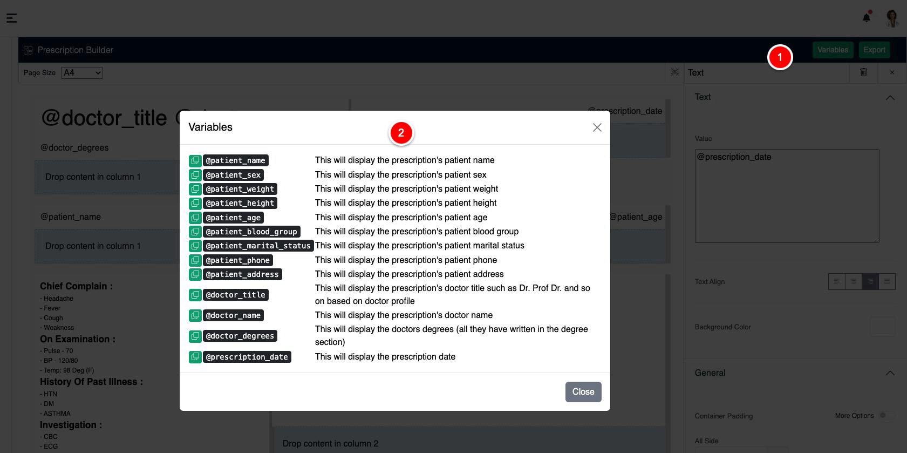
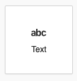
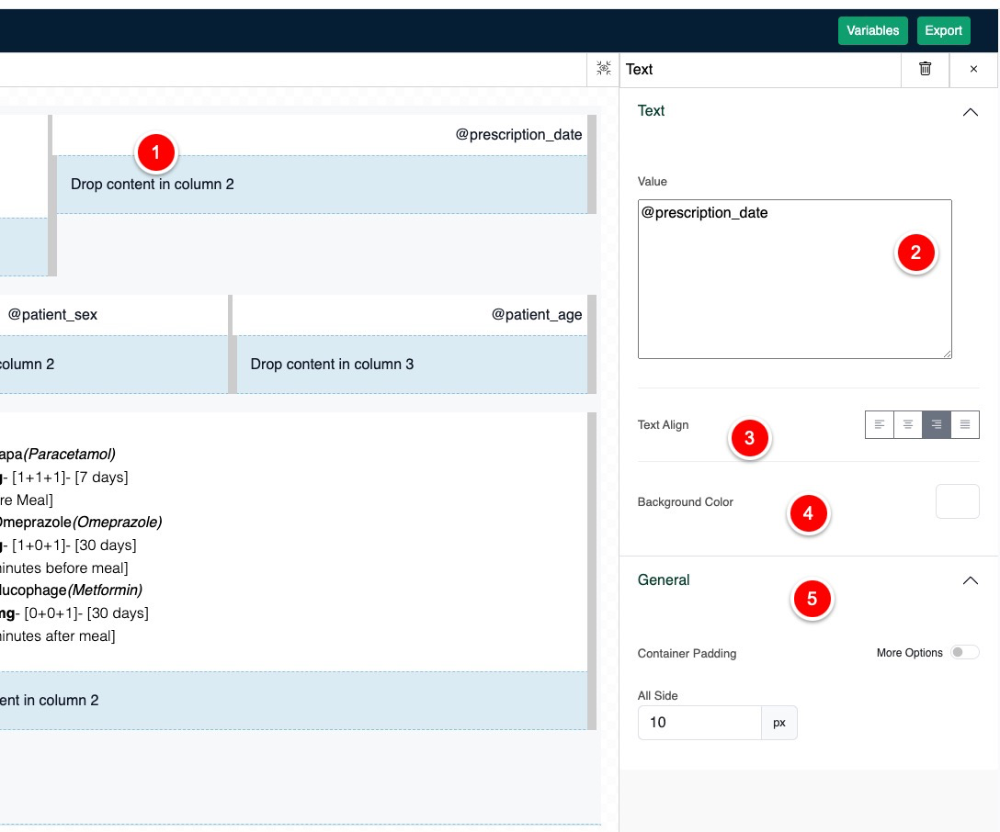
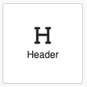
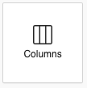
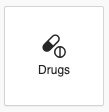
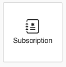

# Prescription Styling

You can style your own prescription from few selected elements and variables. To start styling the prescription need
visit Prescription Builder Page.

## Variables

Variable is used to put dynamic text on static [header](#header) / [text block](#text),
such as if you want to print patient name at anywhere in the prescription just use `@patient_name`
in [text block](#text).
To see available variables click on the variables button, it will open a modal with all available variable

{thumbnail="true"}

## Elements

Elements are designed to be dragged and customize the design such as you can put paddings, colors and so on.
here is the list of elements you will find during styling your prescription.

> Please note that you will only need to style the prescription once, you can use further after creating it
> Doctor can create as many prescription styler they want, but only one at a time will be active
>
{style="note"}

- [Text](#text)
- [Header](#header)
- [Columns](#columns)
- [Drugs](#drugs)
- [Subscription](#subscription)

### Text

Text element is designed to be static text content, you can also pass variables on it to print dynamic content.

<table style="none">
<tr>
<td>
<list style="decimal">
<li>
Here is the dropped text element with variable
</li>
<li>
Text filed to modify text content
</li>
<li>For text alignment</li>
<li>You can put background color on it</li>
<li>This section for padding</li>
</list>
</td>
<td></td>
</tr>
</table>

### Header

### Columns

### Drugs

### Subscription

