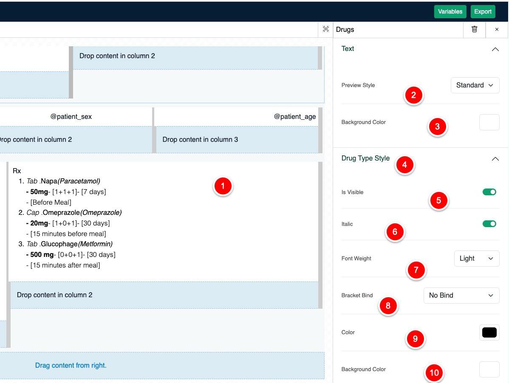

# Prescription Styling

You can style your own prescription from few selected elements and variables. To start styling the prescription need
visit Prescription Builder Page.

1. Page setup
2. [Drag element](#elements)
3. Dropzone
4. [Variables](#variables)
5. Export / Save Prescription Style

## Variables

Variable is used to put dynamic text on static [header](#header) / [text block](#text),
such as if you want to print patient name at anywhere in the prescription just use `@patient_name`
in [text block](#text).
To see available variables click on the variables button, it will open a modal with all available variable

{thumbnail="true"}

## Elements

Elements are designed to be dragged and customize the design such as you can put paddings, colors and so on.
here is the list of elements you will find during styling your prescription.

> Please note that you will only need to style the prescription once, you can use further after creating it
> Doctor can create as many prescription styler they want, but only one at a time will be active
>
{style="note"}

- [Text](#text)
- [Header](#header)
- [Columns](#columns)
- [Drugs](#drugs)
- [Subscription](#subscription)

### Text

Text element is designed to be static text content, you can also pass variables on it to print dynamic content.

<table style="none">
<tr>
<td>
<list style="decimal">
<li>
Here is the dropped text element with variable
</li>
<li>
Text filed to modify text content
</li>
<li>For text alignment</li>
<li>You can put background color on it</li>
<li>This section for padding</li>
</list>
</td>
<td></td>
</tr>
</table>

### Header

<table style="none">
<tr>
<td>
<list style="decimal">
<li>
Select Header element after drop it
</li>
<li>
Modify header value, you can use <a href="#variables">variables</a> as well
</li>
<li>you can pick header size from h1 to h4</li>
<li>Font style, regular, italic, bold</li>
<li>font color from color picker</li>
<li>background color from color picker</li>
<li>Text align, left , right , center, justify</li>
<li>Padding</li>
</list>
</td>
<td></td>
</tr>
</table>

### Columns

Column element is the only element where you can drop other elements, columns can be resize by dragging it from a brack
point to left and right.

{thumbnail="true"}

1. Breakpoint where you can click hold and drag it left or right to resize
2. Number of column, set from 1 to 12
3. Column padding

### Drugs

<table style="none">
<tr>
<td>
<list style="decimal">
<li>
Select drug element after drop it
</li>
<li>
Select drug style from preset design
</li>
<li>You can collapse the drug type style by clicking the up arrow on right</li>
<li>It will hide or show drug style</li>
<li>Turn drug style into italic</li>
<li>Set font weight</li>
<li>Bracket bind: You can bind the drug type by first, second or third bracket</li>
<li>You can set the font color</li>
<li>You can set the background color</li>
<li>You can prefix string / symbol</li>
<li>You can subfix string / symbol</li>
</list>
</td>
<td></td>
</tr>
<tr>
<td colspan="2">
<note>

You can do the same for Drug Trade Name, Drug Generic Name, Doses, Duration, Strength and Drug Advice

</note>
</td>
</tr>
</table>

### Subscription

<table style="none">
<tr>
<td>
<list style="decimal">
<li>
Select Subscription after drop it
</li>
<li>
You can change the subscription font style
</li>
<li>Chang the font weight of subscription label </li>
<li>Change the background color of subscription label</li>
<li>Change font color of subscription label</li>
<li>Change font size of subscription label</li>
<li>You can prefix string / symbol</li>
<li>You can subfix string / symbol</li>
</list>
</td>
<td></td>
</tr>
<tr>
<td colspan="2">
<note>

You can do the same for Subscription Content

</note>
</td>
</tr>
</table>