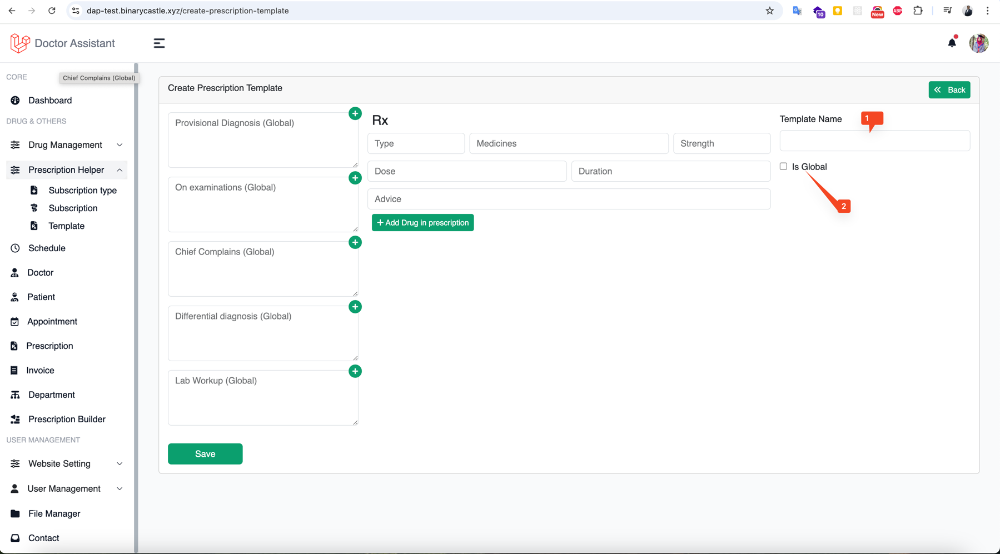
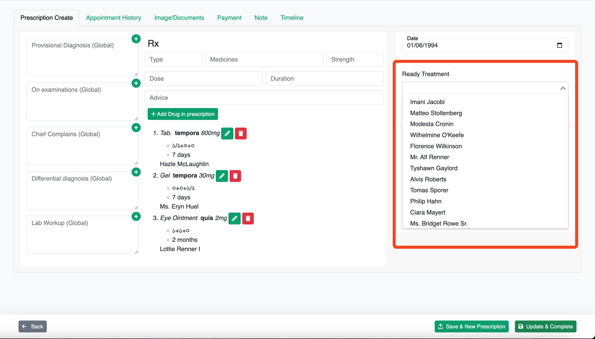
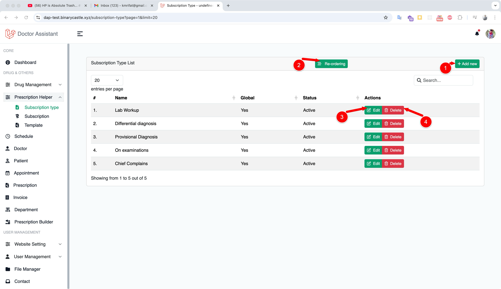
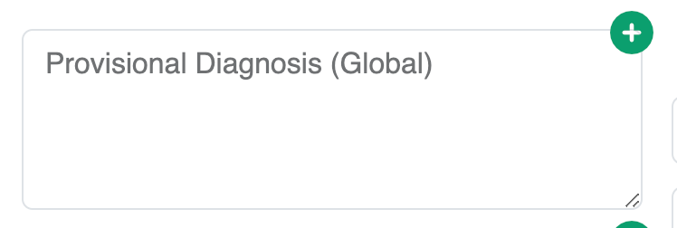

# Prescription Helpers

Prescription helper is allow to make the prescription easy, once you put any new subscription / subscription type /
drug / advice / strength or any other thing in an prescription, it will be stored by the system automatically so it can
be use further when you start typing any of the word what wrote before in the particulate field.

## Templates

It's same as [Prescription](prescription.md) the different is that you don't need an appointment or patient
store a prescription template.
You can store few template which you can repetitively use while you write an actual prescription. Note that you can
modify your prescription while you are using any template.

### Create Template

To create a template click on "Prescription Helper" from the left sidebar then click on Template.
Click on Add New Button to create a template.

{thumbnail="true"}

1. Give your template a name as identifier and it's required
2. Is global will allow to use your template to other user / doctor
   rest of the parts are as same as [Create Prescription](prescription.md#prescription-writing).

### Use a Template

You can use template during [writing a prescription](prescription.md#prescription-writing)

{thumbnail="true"}

Use this read mark (ready treatment) to use template in your prescription.

## Subscription Type

By Default You will see Provisional Diagnosis, On Examination, Chief Complain, Differential diagnosis and Lab Workup.
But if you want you can modify their title, create a new one and reorder them as you want.

> As a doctor if you reorder or create a new subscription it's not gonna change other doctors experience.
>
{style="tip"}

To create, edit, delete or reorder Subscription type Click on "Subscription Type" under Prescription Helper from left
sidebar.

<table>
<tr>
<td> 
<list style="decimal">
<li>
Click to add new Subscription type
</li>
<li>
Click to reorder them
</li>
<li>To edit a subscription click this button</li>
<li>To delete a subscription click this button</li>
</list>
</td>
<td>  </td>
</tr>
</table>

## Subscription Helpers

{width="200"}{style="inline"} You will see a plus
button on top of the Subscription type. By clicking on it you will all the Subscriptions what you added earlier in other
prescription.
You can also create helpers without creating a prescription. To do that click on Prescription Helper then Subscription.
Now you can add a subscription to a subscription type.