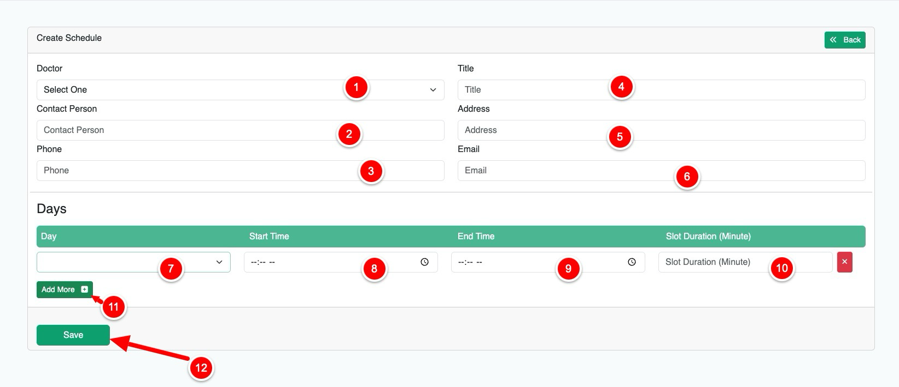
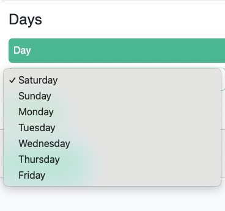

# Schedule

{thumbnail="true"}

# Creating a Doctor's Schedule

1. **Select Doctor**
   Select the doctor for whom you want to create a schedule.

   > **Note**: When logged in as a doctor, you can only create and manage your own schedule.

2. **Contact Information**
    - Enter the contact person's full name
    - Enter the contact person's phone number
    - Enter the contact person's email address

3. **Schedule Details**
    - Enter a descriptive title (e.g., "Consultations at City General Hospital")
    - Enter the complete address (e.g., "123 Medical Center Road, Dhaka, Bangladesh")

4. **Time Slots**
    - Select the day of the week from the dropdown menu (Monday to Saturday)
      {style="inline"}
    - Enter the start time (e.g., "10:00 AM")
    - Enter the end time (e.g., "2:00 PM")
    - Enter the duration of each appointment in minutes

   > **Note on Time Slots**:
   > The system automatically divides the schedule into equal time slots based on your inputs.
   >
   > **Example**:
   > * Start time: 10:00 AM
   > * End time: 12:00 PM
   > * Duration: 30 minutes
   >
   > This creates 4 appointment slots:
   > * 10:00 AM - 10:30 AM
   > * 10:30 AM - 11:00 AM
   > * 11:00 AM - 11:30 AM
   > * 11:30 AM - 12:00 PM