# Web Pages

**%product%** Has dynamic page builder, where you can create a new page, modify page content on the fly.
To create or modify a page / page content, Click on Website Setting then Click on Pages under
it. 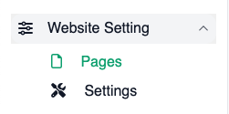{style="inline"}

## Create New Webpage

Click on 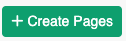{style="inline"} to create a new webpage. You will see
`create page` Form where you will have Page Name, Slug and Status.

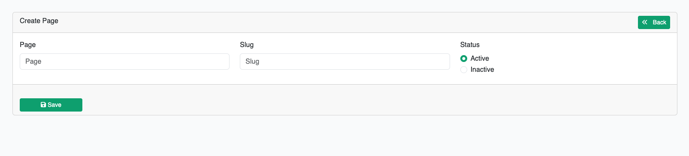

When you are done with this form just hit the save button, it will appear this modal bellow

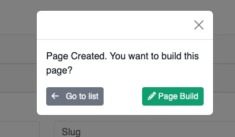

Click the [Page builder](#page-builder) button to start [adding content](#elements) on it.

## Page Builder

Page builder is Drag n Drop Page builder simpler to GrespJs / Elementor where you can drag and drop element, style them
and make them dynamic if any element support to.

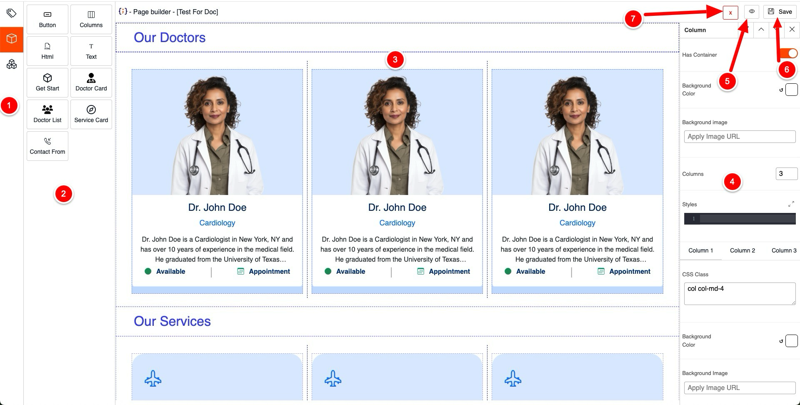{thumbnail="true"}

1. This is the main sidebar where you can add [page meta](#page-meta), [elements](#elements) & [completes](#components).
2. This is Secondly sidebar where you will see the sub items what have you picked from the main sidebar
3. This is the dropzone, where you can drag and drop and element from Secondly sidebar
4. Element / Component Option, you can modify the element / component content, style them make them dynamic if component
   support content allocation
5. Click to preview what have you dropped in the dropzone
6. Save the content what you added in the dropzone
7. Close this button to get back to the main dashboard

## Page Meta

Page meta will help to do SEO, using page meta option you can set as many page meta as you want.
To create page meta click on the tags icon from the main sidebar, you will see a form has Meta Property and Meta content
filed, fill them up and hit submit, It will store a meta and empty the form so you can add more

## Elements

Elements is the dribble items what you can drop on the dropzone, here is the list of element what you can use in
**%product%**.

<table style="none">
<tr>
<th>
<b>Button Element</b>, can be use as a button or an anchor tag, you can style it by putting css-classes
(mostly bootstrap class are supported) or use the style option where you write css to style the element
</th>
<th>
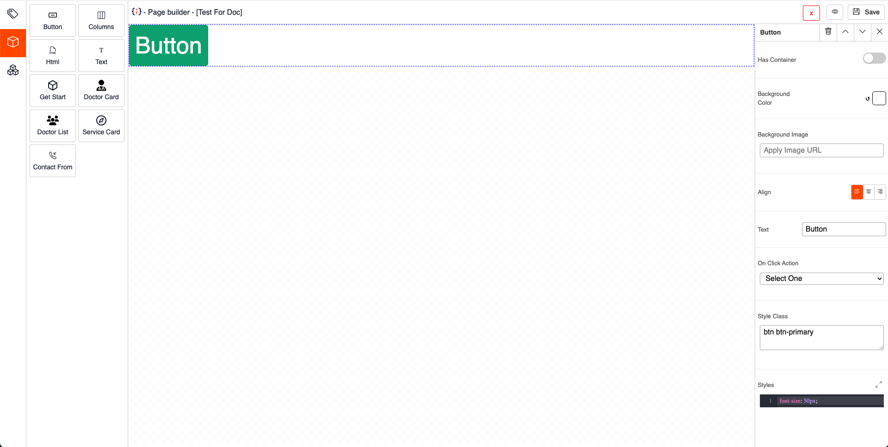
</th>
</tr>

<tr>
<th>
<b>Columns Element</b>, To organise other element in a row you can use this element, this element support to drop other element on it, 
By default it has 3 column but you can change it from 1 to 12 from the Column Input at Column Option

You style each of the column by clicking on the column tab, each column has separate styles, background image, background color. 

</th>
<th>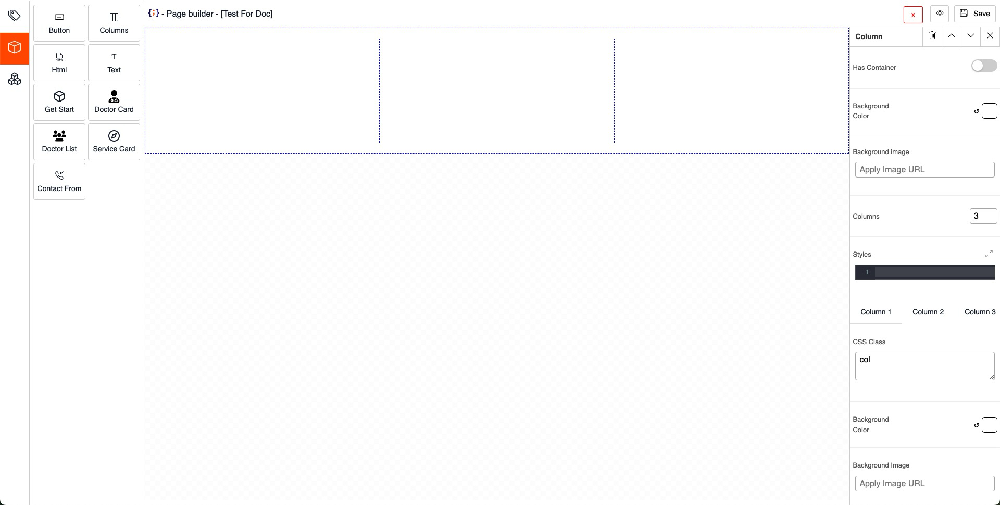
</th>
</tr>

<tr>
<th>
<b>HTML Element</b>, If you looking for something is there in the element list you can design one all your own using this element, 
it's support html tag and css to style whatever you want to design.
</th>
<th>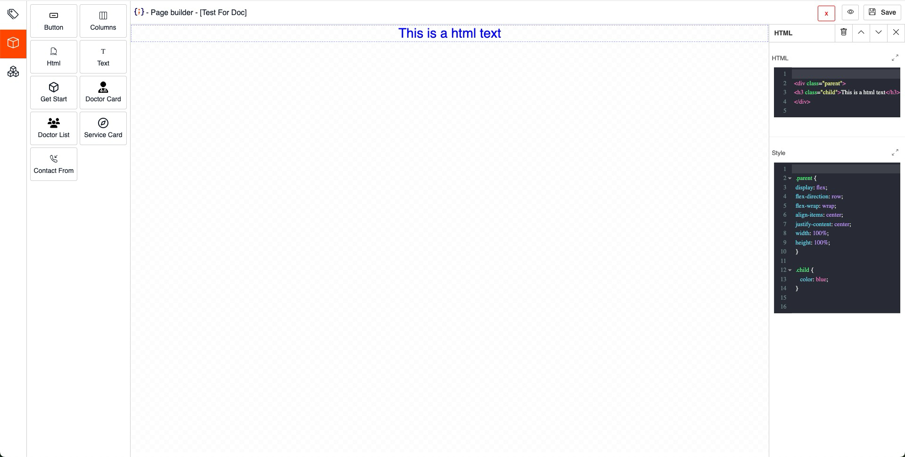</th>
</tr>

<tr>
<th>
<b>Text Element</b>, The real content, you can modify the size, color, alignment and many more here.

Ideal for writing blog or static content in the webpage

</th>
<th>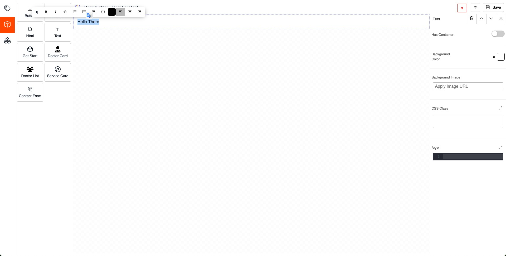</th>
</tr>

<tr>
<th>
<b>Get Start</b>, Just an hero element to get start with, have few text and image what can be changed from the Get Start Option
</th>
<th>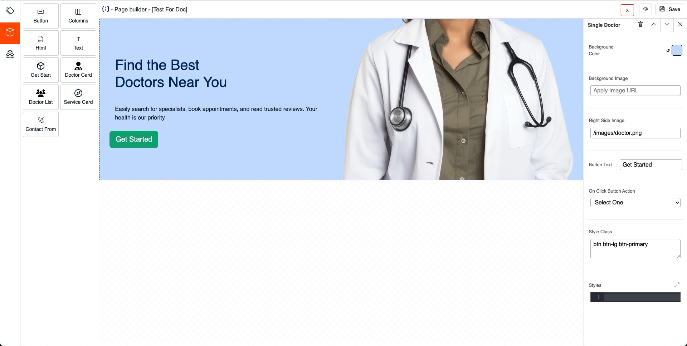</th>
</tr>

<tr>
<th>
<b>Doctor Card</b>, You can use this element if you want to show a specific doctor at specific part of any page, 
After dropping the doctor card you can pick the doctor you want to show from the Doctor Card option.
</th>
<th>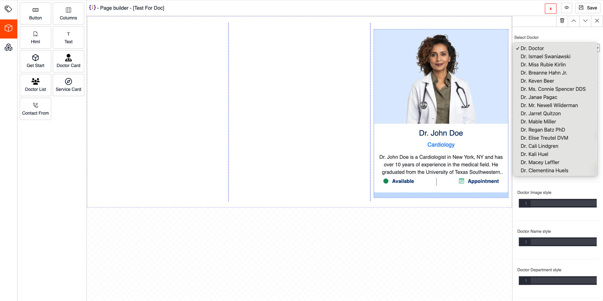</th>
</tr>

<tr>
<th>
<b>Doctor List</b>, It will show the list of the doctor you have in your system. 
You can modify the background color of each doctor, you can modify text style, and many more.
</th>
<th>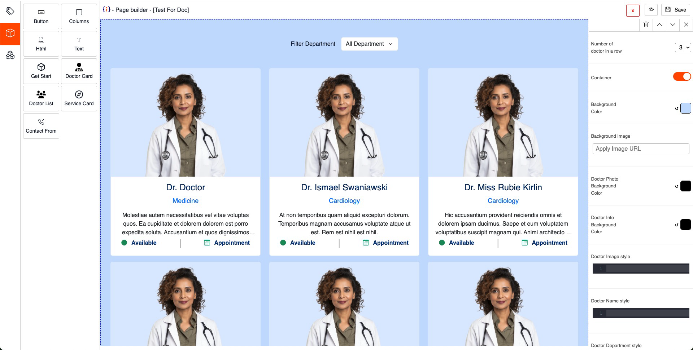</th>
</tr>

<tr>
<th>
<b>Service Card</b>, This is a static design service card, you can modify the icon by putting bootstrap icon or pass an svg in the icon field, 
You can slo change the header by clicking on the header and description.
For control the width of the service, you can drop it at a column.
</th>
<th>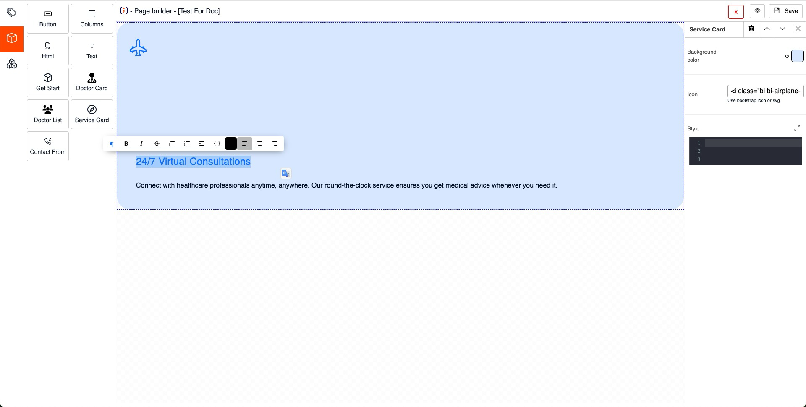</th>
</tr>

<tr>
<th>
<b>Contact Form</b>, It will render a contact from where user / visitor can put down their contact details and message. 
You will see the contact form message at the admin panel.
</th>
<th>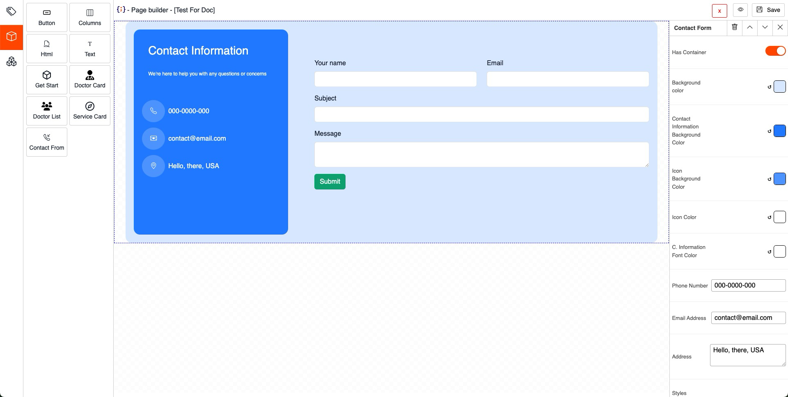</th>
</tr>

</table>

## Components

Component is more versatile element which is design to done a very specific job, in %product% it's doing the role play
for taking appointment from website.

<table style="none">
<tr>
<td>
<b>Single Doctor</b>, Single doctor component is not only can use for a doctor page, but also it's being to take appointment for an individual doctor.
You change the style of almost all the element from the Single Doctor Option
</td>
<td>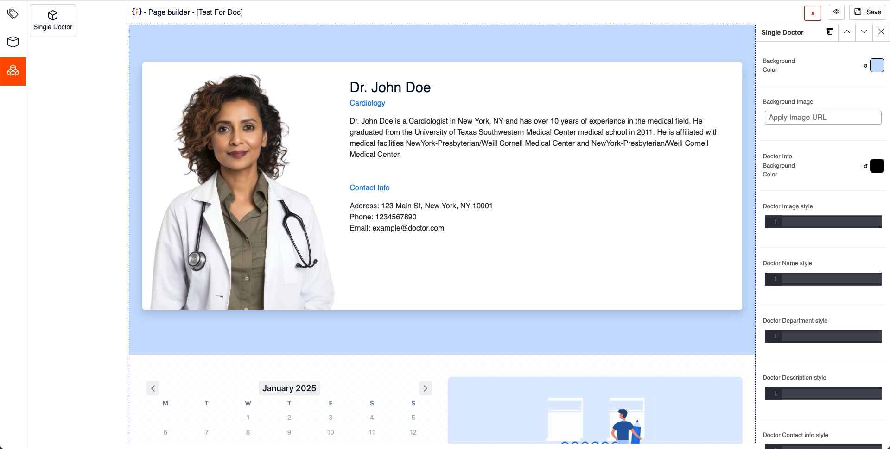</td>
</tr>
</table>