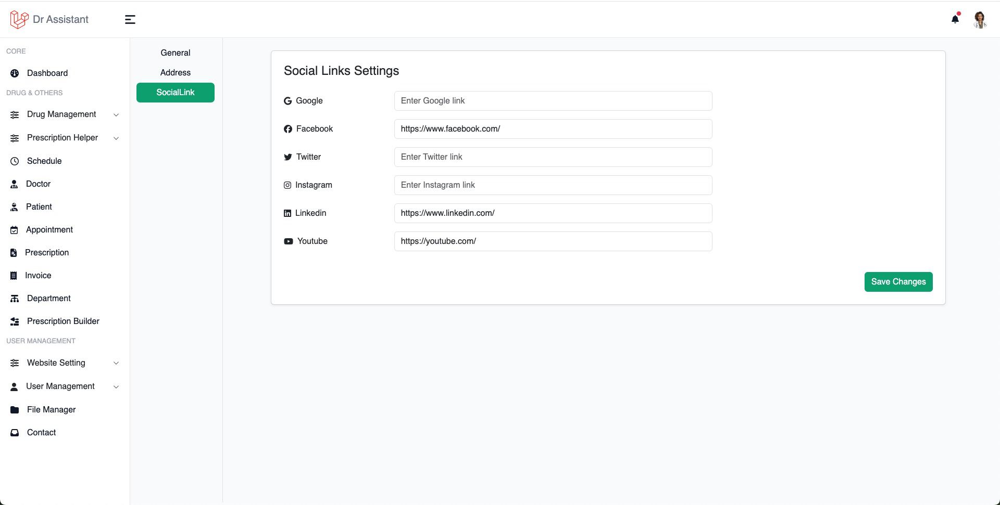

# Website Settings

This setting will control the log, Site Title, contact information, Social links etc. of the %product%.
To access website setting you need to click on Website Setting from the left sidebar and then click on the Settings
under the Website Setting.

<table style="none">
<tr>
<td>
<b>General</b>, You can change log, stie title, website url, date format and meta of the base page
</td>
<td></td>
</tr>

<tr>
<td>
<b>Address</b>, You can added the address of the company
</td>
<td></td>
</tr>

<tr>
<td>
<b>Social Link</b>, You can put the social links
</td>
<td></td>
</tr>
</table>